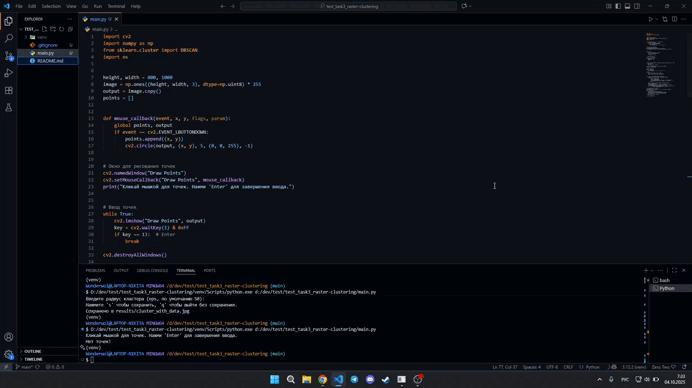

# Кластеризация пространственных данных

## Описание проекта
Программа для ручного ввода точек на белом фоне и визуализации кластеров с использованием алгоритма DBSCAN. Позволяет наглядно видеть, как точки объединяются в кластеры, а также сохранять результат в виде изображения.

Особенности:
- Ручной ввод точек с помощью мыши.
- Настройка радиуса кластера (eps) через терминал.
- Визуализация кластеров с заливкой цветом и подписью количества точек в кластере.
- Обработка шумовых точек (отдельно помечаются серым цветом).
- Сохранение изображения в папку `results` по нажатию клавиши 's' или выход без сохранения по клавише 'q'.

## Технологии:
- Python 3
- OpenCV
- NumPy
- scikit-learn (DBSCAN)

## GIF-демонстрация
  

## Установка и запуск

## 1. Клонируйте репозиторий:
git clone https://github.com/Wonderwol/test_task3_raster-clustering.git
cd test_task3_raster-clustering

## 2. Создайте и активируйте виртуальное окружение:
python -m venv venv

Windows:
venv\Scripts\activate

macOS/Linux:
source venv/bin/activate

## 3. Установите зависимости:
pip install -r requirements.txt

## 4. Запуск программы:
python main.py

## 5. Использование:
- Кликайте мышкой по белому полю, чтобы добавлять точки.
- Нажмите Enter, чтобы завершить ввод точек.
- Введите радиус кластера (eps) в терминале или оставьте пустым для значения по умолчанию (50).
- После визуализации кластеров нажмите:
  - 's' — сохранить изображение в папку results
  - 'q' — выйти без сохранения